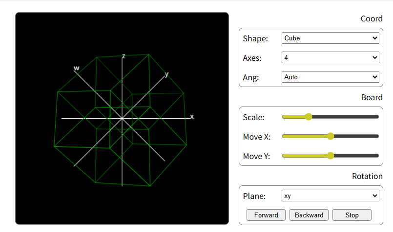
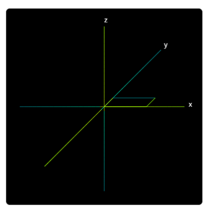
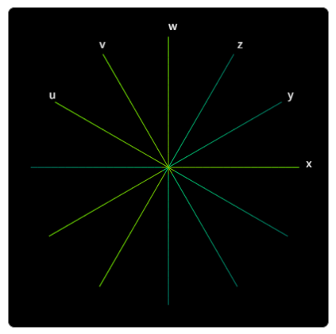

这是一个绘制 4 维及更高维立方体的在线网页。[点击打开网页](https://jjling2011.github.io/Dimention4/)

声明！玩玩就好，这个不是数学意义上的精确图案。

网上的 4 维立方体通常以三维投影的形式演示，看得脑瓜疼。为什么用投影而不直接画出来呢？常见的说法是“我们生活在三维空间无画出四维”。然而屏幕以及我们的视网膜都是二维的，我们根本没有真正看过三维，但这并不影响我们理解三维。所以真正的问题是第 4 条轴在哪里？

上面是常见的三维坐标，我们的思维习惯是这三个轴已经占居了所有位置，没地方放更多轴。其实不然。注意 y 轴和 x 轴是 45 度角并不垂直。所以 z 轴和 x 负半轴之间还有个空位。如果不限定 z 轴和 x 轴成 90 度角，那么还可以放入更多的轴。

酱。
