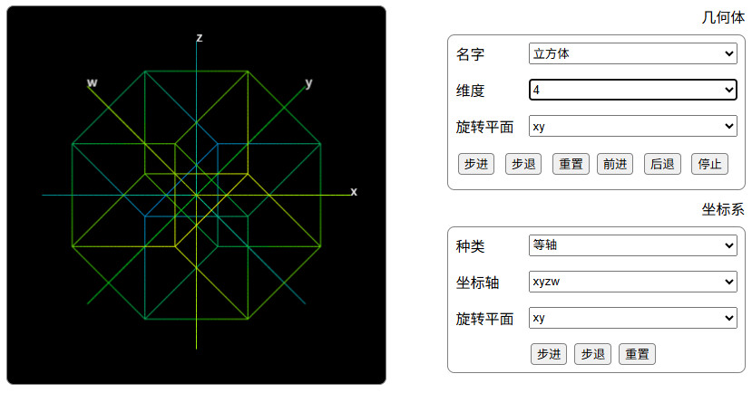

这是一个绘制 4 维及更高维几何体的在线网页。  
在线演示：[https://jjling2011.github.io/Dimension4/](https://jjling2011.github.io/Dimension4/)

注意！这不是数学意义上的精确图案，玩玩就好。

网上的 4 维几何体通常以三维投影的形式演示，看得脑瓜疼。为什么用投影而不直接画出来呢？常见的说法是“我们生活在三维空间无画出四维”。然而屏幕以及我们的视网膜都是二维的，我们根本没有真正看过三维，但这并不影响我们理解三维。所以真正的问题是第 4 条坐标轴在哪里？

上面是常见的三维坐标，我们的思维习惯是 xyz 轴已经占居了所有位置，没地方放更多轴。其实不然。注意 y 轴和 x 轴是 45 度角并不垂直。所以 z 轴和 x 负半轴之间还有个空位。如果不限定 z 轴和 x 轴成 90 度角，那么还可以放入更多的轴。

坐标轴和平面的特点：

1.  只有两个轴所在的平面可以旋转，轴本身不可以旋转。比如旋转 x 轴，实际是旋转和他对应的 yz 平面。
2.  旋转一个平面，其实是重新分配两个坐标轴的数值。比如二维向量 `(1, 0)` 旋转 `PI/2` 其实就是重新分配成 `(cos(PI/2), sin(PI/2))`。注意省略了值为零的部分。
3.  坐标轴并不一定要互相垂直，只需保持 `#2` 中的分配关系。
4.  前面三点可以扩展到任意高维度。
5.  这些特点仅适用于这个项目。

这个项目的关键是把坐标轴互相垂直这个条件去掉。如果我们把坐标轴是直线这个条件也去掉呢？

下面是把 xy 轴替换成 cos 函数后，画出来的三维球体：

制作这个网页的时候，发现莫比乌斯环（Mobius strip）其实就是一个向量同时在两个平面里旋转，并且其中一个平面的旋转速度是另一个的1/2。和电子的自旋有点像。
