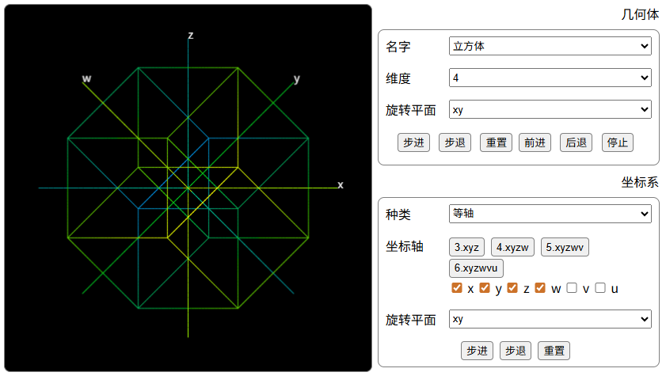
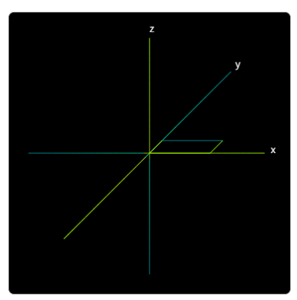
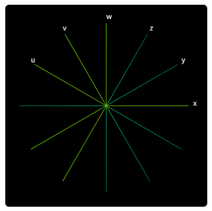
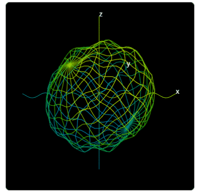
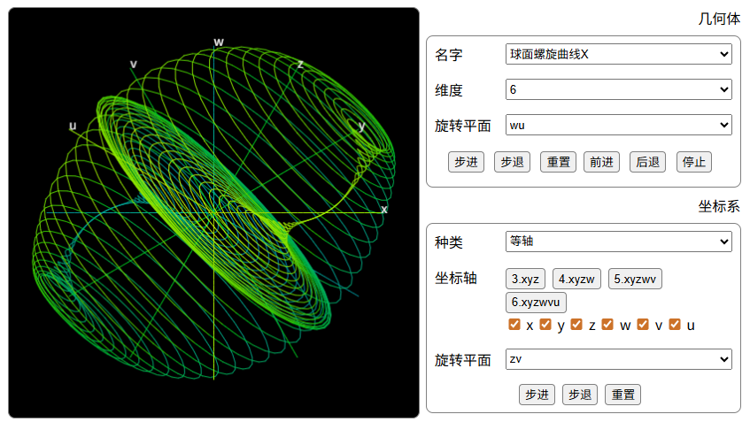
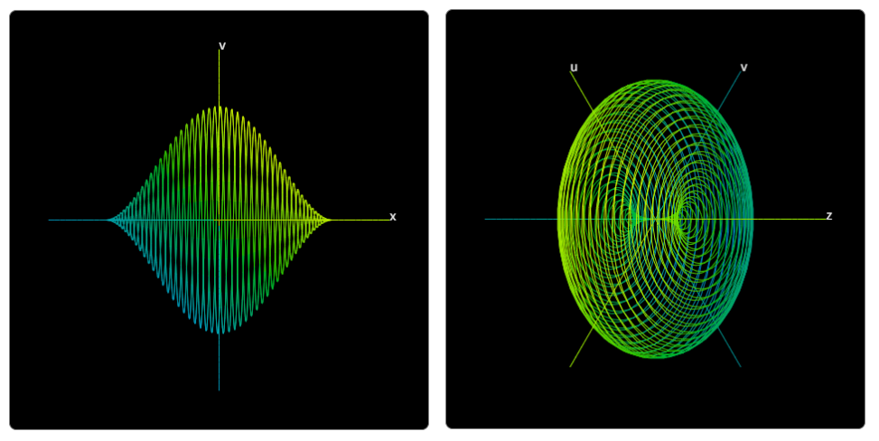
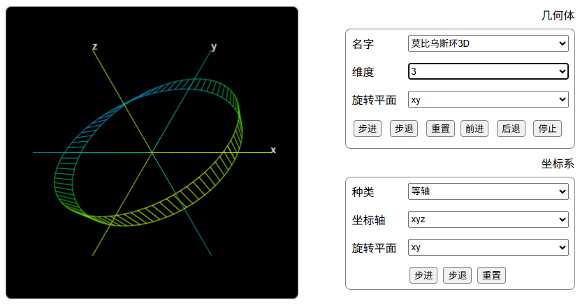

这是一个绘制 4 维及更高维几何体的在线网页。  
在线演示网址：[https://jjling2011.github.io/Dimension4/](https://jjling2011.github.io/Dimension4/)

注意！这不是数学意义上的精确图案，玩玩就好。

网上的 4 维几何体通常以三维投影的形式演示，看得脑瓜疼。为什么用投影而不直接画出来呢？常见的说法是“我们生活在三维空间画不出四维”。然而屏幕以及我们的视网膜都是二维的，我们从来没有真正看过三维，但这并不影响我们理解三维。所以真正的问题是第 4 条坐标轴在哪里？下面是常见的三维坐标系：

我们的思维习惯是 xyz 轴已经占居了所有位置，没地方放更多轴。其实不然。注意 y 轴和 x 轴是 45 度角并不垂直。所以 z 轴和 x 负半轴之间还有个空位。如果不限定 z 轴和 x 轴成 90 度角，那么还可以放入更多的轴。

如果我们把坐标轴是直线这个条件也去掉呢？下面是把 xy 轴替换成 cos 曲线画出来的三维球体：

这是一个向量沿高维球面旋转的轨迹：
  
观察二维 xv 坐标轴时像一个波包，观察三维 zvu 坐标轴时像一个甜甜圈：

如果一个向量同时在两个平面里旋转，并且其中一个旋转速度是另一个的 `1/2` 时，那么就得到一个莫比乌斯环：

制作这个网页时的一些发现：

1.  坐标轴不可以旋转，平面才可以旋转。比如旋转 x 轴，实际上是旋转和他对应的 yz 平面。
2.  旋转一个平面，其实是重新分配构成平面的两个维度的数值。比如二维向量 `(1, 0)` 旋转 `PI/2` 其实就是重新分配成 `(cos(PI/2), sin(PI/2))`。注意省略了值为零的部分。
3.  绘图时高维点到屏幕像素的映射关系，和坐标轴到屏幕像素的映射关系是等价的。
4.  这些发现仅适用于这个项目。

为什么说轴不可以旋转：

我们之所以有轴可以旋转的错觉，是因为三维空间的轴数量正好等于平面数量。换个说法就是一个向量只有一组平行的平面和他垂直。其他维度空间并不满足这个条件。比如在二维 xy 平面里面旋转 x 轴或者 y 轴是什么鬼操作？在高维，比如 4 维空间里面，一个轴有 3 个对应平面。一方面平面的旋转顺序会影响结果，另一方面每个平面的旋转角速度其实可以不相等。因此用轴（或者向量）去定义旋转只适用于三维空间。

几何体名字解释：

1. 名字后面带 “2D”，“3D” 表示这个几何只使用了 2 个或者 3 个维度，其他维度的初始数值都是零。
2. “球面螺旋曲线” 是一个单位向量沿着一条类似阿基米德渐开线的曲线在高维球面旋转时走过的轨迹。降低到 3 维，观察 xyz 坐标轴会更容易理解些。名字后面的 “X” 表示从 X 轴开始画，只画一条轨迹。“XY” 表示画两条轨迹。没带后缀的就是每个维度都画一次。（我也不知道为啥高维的轨迹看起来那么奇怪，但是我算过每个点到原点的距离都是 1）
3. “移动螺旋曲线” 是在绘制 “球面螺旋曲线” 的时候，加入 X 轴水平移动。因为 X 轴被占用，所以要减少一个维度。比如 4 维的 “移动螺旋曲线” 是 3 维的 “球面螺旋曲线” 在 X 轴移动的轨迹。
